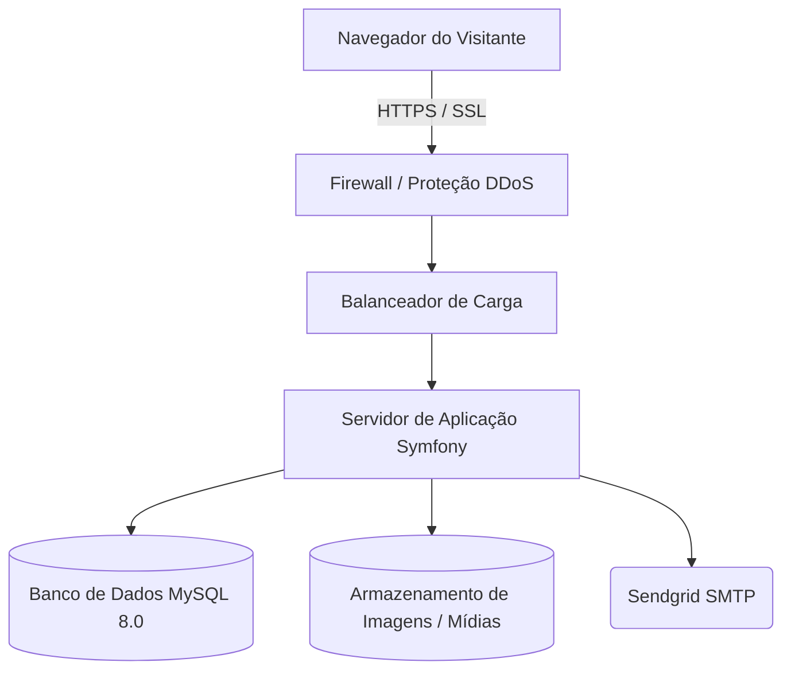

PROPOSTA TÉCNICA COMERCIAL
DESENVOLVIMENTO DE SISTEMA DE GESTÃO DE NOTÍCIAS
AO

Fundecitrus
A/C: Denise

Primeiramente, gostaríamos de agradecer pela oportunidade de trabalhar com a sua empresa.
A WAB Agência Digital é uma empresa brasileira especializada em soluções digitais para auxiliar outras empresas a alcançarem seus objetivos de negócio. Atuamos com o desenvolvimento de sites personalizados, sistemas sob demanda, aplicativos móveis, integração de sistemas, hospedagem web, consultoria em tecnologia e marketing digital.
A solução apresentada nesta proposta foi elaborada por nossa equipe após análise das necessidades levantadas, considerando o cenário atual do Fundecitrus e a necessidade de criar uma plataforma centralizada para a gestão e divulgação de notícias institucionais, pesquisas e comunicados.
A nossa equipe está à disposição para quaisquer esclarecimentos adicionais ou para discutir os detalhes do projeto pelos telefones (16) 98179-0888 / (16) 3332-7798 ou pelo e-mail wab@wab.com.br.

Araraquara, 24 de março de 2026.

_____________________________________
Jonas Ernesto Poli
CPF: 296.652.468-52
M. DUDALSKI & CIA SOLUÇÕES EM INTERNET LTDA - ME
CNPJ: 07.270.504/0001-70

Wab Agência Digital
Padre Duarte. 151 - Sala 152

Orçamento OSI-260324-1
Página 1

Tel 16 3332 7798
Edifício América - Araraquara - SP

---

DESENVOLVIMENTO DE SISTEMA
DESCRIÇÃO DO ORÇAMENTO

O objetivo deste documento é descrever o desenvolvimento de um sistema de gestão de notícias em Symfony para o Fundecitrus, que permitirá a publicação centralizada de notícias, pesquisas e comunicados institucionais.

O sistema será composto por duas grandes áreas: uma área restrita de administração, voltada para a equipe interna do Fundecitrus, e uma área pública de leitura, acessível a todos os visitantes do portal.

A proposta contempla a criação de uma plataforma estruturada e escalável, pensada para viabilizar a publicação organizada de conteúdos jornalísticos e científicos, alinhada à identidade e aos objetivos de comunicação da instituição.

---

# CENÁRIO GERAL

O Fundecitrus possui uma produção contínua de conteúdo informativo — notícias sobre o setor citrícola, resultados de pesquisas, comunicados técnicos e informações institucionais — que precisa ser gerenciada e publicada de forma organizada e profissional.

Atualmente, esse fluxo de publicação carece de um sistema próprio, flexível e de fácil uso, que permita à equipe interna cadastrar, revisar e publicar conteúdos com autonomia, sem depender do time técnico para cada atualização.

A WAB propõe o desenvolvimento de um sistema dedicado, construído sobre o framework Symfony, capaz de atender às demandas atuais e preparado para crescer junto com as necessidades futuras da instituição.

---

TECNOLOGIA UTILIZADA

O desenvolvimento do sistema será realizado utilizando o framework Symfony, reconhecido por sua segurança, robustez e flexibilidade para projetos que exigem maior controle, escalabilidade e possibilidade de evolução futura.

Entre as vantagens do Symfony para este projeto, destacam-se:

- **Segurança avançada**: proteção contra vulnerabilidades comuns, com estrutura adequada para autenticação, controle de acesso e integridade dos dados;
- **Flexibilidade**: arquitetura preparada para novas funcionalidades futuras, sem comprometer a base inicial do projeto;
- **Desempenho otimizado**: estrutura leve, organizada e adequada para aplicações corporativas;
- **Escalabilidade**: possibilidade de ampliação da plataforma com novos módulos, categorias e integrações;
- **Suporte de longo prazo**: utilização de tecnologia consolidada e adotada em projetos empresariais de médio e grande porte.

O sistema será desenvolvido com um editor avançado de conteúdo rico (RichText), garantindo uma experiência de publicação fluida e profissional para a equipe de redação.

---

Wab Agência Digital
Padre Duarte. 151 - Sala 152

Orçamento OSI-260324-1
Página 2

Tel 16 3332 7798
Edifício América - Araraquara - SP

---

ESTRUTURA DO NOVO SISTEMA

## ÁREA PÚBLICA

A área pública será o portal de notícias do Fundecitrus, acessível a qualquer visitante sem necessidade de cadastro ou autenticação. Será desenvolvida com foco em legibilidade, navegação intuitiva e compatibilidade com todos os dispositivos modernos (responsivo para Desktop, Tablet e Mobile).

---

### Home do Portal de Notícias

A página principal do portal apresentará as notícias mais recentes de forma organizada e atrativa. Nesta área, poderão ser exibidos:

- Notícia principal em destaque (hero);
- Grade de notícias recentes;
- Filtro por categorias;
- Campo de busca textual;
- Paginação das listagens;
- Banners e imagens institucionais do Fundecitrus.

A estrutura da home será pensada para facilitar a navegação do visitante e destacar o conteúdo mais relevante da instituição, respeitando as cores e identidade visual do Fundecitrus (verde #008D36, laranja #F58220, amarelo #FDB913).

---

Wab Agência Digital
Padre Duarte. 151 - Sala 152

Orçamento OSI-260324-1
Página 3

Tel 16 3332 7798
Edifício América - Araraquara - SP

---

### Página de Leitura da Notícia

Cada notícia possuirá uma página própria, com URL amigável (slug) e conteúdo específico. Nesta página poderão ser exibidos:

- Título da notícia;
- Subtítulo / resumo;
- Imagem de capa;
- Categoria(s) da notícia;
- Data de publicação;
- Nome do autor (opcional);
- Corpo da notícia (conteúdo Rich Text, com suporte a imagens, vídeos, tabelas, listas e links);
- Tags relacionadas;
- Notícias relacionadas (sugestões ao final da leitura);
- Botões de compartilhamento.

A página de leitura será otimizada para uma experiência de leitura fluida, com tipografia, espaçamento e hierarquia de conteúdo cuidadosamente escolhidos.

---

### Busca e Filtros

O portal contará com mecanismo de busca textual integrado, permitindo ao visitante localizar notícias por palavras-chave, categoria ou período de publicação. Os resultados serão exibidos em listagem paginada com prévia do conteúdo.

---

Wab Agência Digital
Padre Duarte. 151 - Sala 152

Orçamento OSI-260324-1
Página 4

Tel 16 3332 7798
Edifício América - Araraquara - SP

---

## ÁREA RESTRITA (PAINEL ADMINISTRATIVO)

A área administrativa do sistema será acessível apenas por usuários autorizados, mediante autenticação segura com login e senha. Ela permitirá o gerenciamento completo das notícias, categorias e usuários do sistema.

---

### Módulo de Autenticação e Segurança

O sistema contará com um módulo de autenticação segura, incluindo:

- Tela de login com usuário e senha;
- Recuperação de senha por e-mail (token temporário);
- Controle de sessão e logout automático por inatividade;
- Perfis de acesso diferenciados (Administrador e Editor);
- Log de auditoria com registro de ações críticas (criação, edição e exclusão de conteúdos).

**Perfis de Acesso:**

| Perfil       | Permissões                                                                                     |
|-------------|-----------------------------------------------------------------------------------------------|
| Administrador | Acesso total: notícias, categorias, usuários, configurações do sistema.                      |
| Editor       | Acesso às notícias (criação, edição, envio para revisão) e à área de categorias (somente leitura). |

---

Wab Agência Digital
Padre Duarte. 151 - Sala 152

Orçamento OSI-260324-1
Página 5

Tel 16 3332 7798
Edifício América - Araraquara - SP

---

### Dashboard Administrativo

O sistema contará com um painel inicial com visão resumida das principais informações operacionais, como:

- Total de notícias cadastradas;
- Notícias publicadas;
- Notícias pendentes de revisão;
- Rascunhos em andamento;
- Total de categorias cadastradas;
- Total de usuários ativos;
- Atalhos rápidos para as principais ações.

O dashboard oferecerá uma visão executiva do fluxo de publicação, permitindo que gestores e editores tenham situacional awareness imediata ao acessar o sistema.

---

Wab Agência Digital
Padre Duarte. 151 - Sala 152

Orçamento OSI-260324-1
Página 6

Tel 16 3332 7798
Edifício América - Araraquara - SP

---

### Módulo de Gestão de Notícias

O módulo central do sistema permitirá o cadastro, edição, revisão e publicação de notícias com controle total do fluxo editorial.

**Listagem de Notícias (DataTable)**

A listagem apresentará todas as notícias cadastradas em formato de tabela interativa, com:

- Busca por título, categoria ou status;
- Filtros por status (rascunho, pendente, publicada, despublicada);
- Filtros por categoria e por data de publicação;
- Paginação configurável;
- Ações rápidas por linha (editar, publicar/despublicar, excluir);
- Ordenação por coluna.

**Cadastro e Edição de Notícia**

O formulário de criação e edição de notícia contemplará os seguintes campos:

- Título;
- Subtítulo / Resumo;
- Slug (URL amigável — gerado automaticamente a partir do título, editável);
- Categoria(s) — múltipla seleção;
- Tags — múltipla seleção / criação livre;
- Imagem de Capa — upload com pré-visualização;
- Autor (campo texto livre ou seleção de usuário do sistema);
- Data de Publicação — com suporte a agendamento futuro;
- Status — Rascunho / Aguardando Revisão / Publicada / Despublicada;
- Conteúdo — editor Rich Text avançado (TipTap / Quill ou similar) com suporte a:
  - Formatação de texto (negrito, itálico, sublinhado, alinhamento);
  - Headings (H1 a H6);
  - Listas ordenadas e não ordenadas;
  - Tabelas;
  - Inserção de imagens (com upload embutido);
  - Inserção de links e links externos;
  - Incorporação de vídeos (YouTube/Vimeo);
  - Blocos de destaque / citações;
  - HTML bruto (modo avançado).

**Fluxo de Publicação**

O sistema suportará o seguinte fluxo editorial:

1. Editor cria a notícia como **Rascunho**.
2. Editor finaliza e envia para **Revisão**.
3. Administrador **Publica** ou **Rejeita** (retornando ao editor).
4. Notícia fica disponível na área pública, com a data de publicação definida.
5. Notícia pode ser **Despublicada** a qualquer momento pelo Administrador.

O sistema também suportará o **agendamento de publicação**, no qual a notícia permanece como "publicação agendada" e é disponibilizada automaticamente na data e hora configuradas.

---

Wab Agência Digital
Padre Duarte. 151 - Sala 152

Orçamento OSI-260324-1
Página 7

Tel 16 3332 7798
Edifício América - Araraquara - SP

---

### Módulo de Gestão de Categorias

O sistema contará com um módulo de gerenciamento de categorias, utilizado tanto na área pública (como filtros de navegação) quanto na área administrativa (para organização do conteúdo).

**Listagem de Categorias (DataTable)**

- Listagem das categorias cadastradas com nome, descrição e status;
- Botões de edição e exclusão por linha;
- Indicador de quantidade de notícias associadas.

**Cadastro de Categoria**

- Nome da categoria;
- Slug (URL amigável — gerado automaticamente);
- Descrição (opcional);
- Status: Ativa / Inativa;
- Cor de identificação (opcional, para destaque visual).

---

Wab Agência Digital
Padre Duarte. 151 - Sala 152

Orçamento OSI-260324-1
Página 8

Tel 16 3332 7798
Edifício América - Araraquara - SP

---

### Módulo de Gestão de Usuários

O sistema contará com um módulo de gerenciamento de usuários do painel administrativo.

**Listagem de Usuários (DataTable)**

- Listagem com nome, e-mail, perfil e status;
- Ação de edição, ativação/desativação e exclusão.

**Cadastro de Usuário**

- Nome completo;
- E-mail (utilizado como login);
- Senha (com confirmação e critérios de segurança);
- Perfil de acesso: Administrador ou Editor;
- Status: Ativo / Inativo.

O acesso ao módulo de usuários será exclusivo para perfil **Administrador**.

---

Wab Agência Digital
Padre Duarte. 151 - Sala 152

Orçamento OSI-260324-1
Página 9

Tel 16 3332 7798
Edifício América - Araraquara - SP

---

## ITENS NÃO INCLUSOS

Apenas para documentar, segue uma lista de itens não contemplados por esta proposta e que, caso sejam solicitados, serão cobrados à parte, de acordo com sua complexidade e disponibilidade da equipe.

- **Conteúdo**: o conteúdo textual definitivo, imagens institucionais, artes e materiais necessários para alimentação do sistema deverão ser fornecidos pelo cliente;
- **Correção de material**: a WAB não se responsabiliza por eventuais erros de ortografia ou de interpretação nos textos inseridos pelo cliente utilizando a área administrativa;
- **Suporte a ferramentas de terceiros**: não está incluso neste orçamento o suporte à utilização de ferramentas externas como editores de imagem, softwares de terceiros, plataformas externas e serviços não administrados pela WAB;
- **Ferramentas e serviços de terceiros**: custos relacionados a serviços externos, APIs pagas, plataformas complementares ou recursos contratados de terceiros não estão inclusos, salvo quando expressamente indicados;
- **Manutenção contínua**: a atualização contínua do sistema, inclusão de novas funcionalidades, correções evolutivas e melhorias futuras não estão inclusas neste orçamento;
- **Integração com redes sociais ou plataformas de distribuição de conteúdo** (RSS avançado, distribuição para Google News etc.) serão orçadas separadamente;
- **Atendimento ao público final**: possíveis suportes a leitores ou usuários finais quanto ao uso do portal não estão inclusos nesta proposta;
- **Tradução do conteúdo**: a tradução de notícias para outras línguas não está inclusa, embora o sistema possa ser adaptado futuramente mediante novo escopo.

---

Wab Agência Digital
Padre Duarte. 151 - Sala 152

Orçamento OSI-260324-1
Página 10

Tel 16 3332 7798
Edifício América - Araraquara - SP

---

## PLANEJAMENTO DO PROJETO E METODOLOGIA

### Regras de Alteração de Escopo (Change Request)

Qualquer alteração, funcionalidade adicional ou ajuste de requisito solicitado que não esteja explicitamente detalhado nesta Proposta será considerada uma alteração de escopo (Change Request).

- **Processo:** Toda solicitação de alteração deverá ser documentada por escrito.
- **Orçamento:** A WAB Agência Digital fornecerá um orçamento de horas técnicas, custo e prazo adicionais para a implementação da alteração.
- **Aprovação:** O trabalho de alteração de escopo só será iniciado após a aprovação formal (por e-mail ou assinatura) do cliente sobre o novo orçamento.
- **Base de Custo:** A hora técnica para Change Requests será aplicada conforme a Tabela de Hora Técnica vigente da WAB (**R$ 220,00 por Homem/Hora WAB**).

---

## GARANTIA E NÍVEL DE SERVIÇO (SLA)

### Garantia de Software (Bugfix)

A WAB Agência Digital oferece uma garantia de 180 dias (seis meses) a partir da data do Go-Live (Publicação em Produção) para a correção de quaisquer erros de programação (bugs) ou falhas que desviem do comportamento e requisitos descritos nesta proposta até o limite de 30 horas.

- As correções de bugs dentro deste período serão realizadas sem custo adicional para o cliente.
- A garantia não cobre problemas causados por modificações feitas no código-fonte pelo cliente ou por terceiros não autorizados pela WAB, nem problemas decorrentes da infraestrutura ou de ferramentas de terceiros.

### Acordo de Nível de Serviço (SLA) para Suporte

Após a utilização do pacote inicial de 30 horas de suporte técnico, o cliente poderá contratar pacotes de horas adicionais. O SLA para os serviços de suporte (para problemas ou dúvidas, não cobertos pela garantia de bugfix) será:

| Prioridade  | Definição                                                                                         | Tempo Máximo de Resposta (Início do Atendimento) |
| :---------- | :------------------------------------------------------------------------------------------------ | :----------------------------------------------- |
| **Crítica** | Falha que impede a operação do sistema (ex: Login não funciona, Portal inacessível).             | **2 Horas Úteis**                               |
| **Alta**    | Falha que compromete uma função essencial, mas permite a operação alternativa.                    | **4 Horas Úteis**                               |
| **Média/Baixa** | Dúvidas de uso, ajustes de layout ou falhas não operacionais.                               | **8 Horas Úteis**                               |

---

Wab Agência Digital
Padre Duarte. 151 - Sala 152

Orçamento OSI-260324-1
Página 11

Tel 16 3332 7798
Edifício América - Araraquara - SP

---

## TRANSIÇÃO E TREINAMENTO

### Plano de Migração de Dados

Caso o Fundecitrus possua conteúdo existente que precise ser migrado para o novo sistema (notícias de plataformas anteriores, documentos, etc.), a WAB poderá realizar esta migração mediante escopo adicional.

- **Responsabilidade:** O cliente é responsável por extrair os dados legados do sistema anterior em formato estruturado (CSV, Excel ou similar) com colunas devidamente mapeadas.
- **Importação:** A WAB desenvolverá os scripts necessários para a importação e validação desses dados no novo sistema.

### Treinamento de Usuários

O treinamento visa garantir que a equipe do Fundecitrus utilize o novo sistema de forma eficiente e autônoma.

- **Público-Alvo:** Perfis de Administrador e Editor.
- **Duração e Formato:** A WAB fornecerá até **4 horas de treinamento** em formato remoto (videoconferência gravada disponibilizada ao cliente) com foco no uso prático do painel e no fluxo de publicação de notícias.
- **Conteúdo:** O treinamento abrangerá login, cadastro de categorias, criação e publicação de notícias (incluindo o editor Rich Text), gestão de usuários e operações do Dashboard.

---

Wab Agência Digital
Padre Duarte. 151 - Sala 152

Orçamento OSI-260324-1
Página 12

Tel 16 3332 7798
Edifício América - Araraquara - SP

---

## HOSPEDAGEM INICIAL

Para manter a estrutura do sistema, é necessário a contratação de um plano de hospedagem. Recomendamos um plano de hospedagem inicial conforme tabela abaixo. Em caso de alteração de escopo, o cliente poderá ter a necessidade de um novo plano de hospedagem.

**Mapa da estrutura**
Abaixo segue um mapa de como planejamos montar a estrutura física que conterá o sistema:

### SERVIÇOS INCLUSOS

**SSL para navegação segura (HTTPS):**
Será implementado um certificado SSL para garantir que todas as comunicações com o seu sistema sejam criptografadas e seguras.

**Bcrypt para Criptografia de Senhas:**
Utilizaremos o algoritmo Bcrypt para criptografar as senhas dos usuários, garantindo alta segurança.

**Acesso ao Servidor Apenas por SSH com Chave:**
O acesso ao servidor será restrito apenas a usuários autorizados por meio de autenticação SSH com chaves, garantindo maior segurança.

**Sistema de Envio de E-mails pelo Sendgrid:**
Implementaremos o Sendgrid para garantir um sistema confiável de envio de e-mails (notificações administrativas).

**Firewall dentro da Rede:**
Será configurado um firewall de rede para proteger o seu sistema contra ameaças externas.

**Monitoramento de Uptime 24h por Dia:**
Implementaremos um sistema de monitoramento 24 horas por dia para garantir que o seu sistema esteja sempre disponível.

**Backup Recorrente a Cada 12h por 7 Dias:**
Realizaremos backups recorrentes a cada 12 horas e manteremos os últimos 7 dias de backups disponíveis.

**Versionamento do Projeto com Git/Bitbucket:**
Utilizaremos repositórios privados para o versionamento do seu projeto, garantindo o controle de alterações e a colaboração eficiente.

**Deploy Seguro Apenas com SSH:**
O deploy do seu projeto será realizado de forma segura, apenas por meio de autenticação SSH (Processos de CI/CD automatizados).

### PLANOS DE HOSPEDAGEM
O custo da hospedagem do sistema nos servidores da WAB varia conforme a tabela abaixo:

| | Inicial | Básico | Médio | Avançado |
| :--- | :--- | :--- | :--- | :--- |
| **Espaço em disco** | 10GB | 20GB | 40GB | 70GB |
| **Memória RAM** | 1GB | 2GB | 4GB | 8GB |
| **Transferência** | 1TB | 1TB | 2TB | 4TB |
| **vCPUs** | 1 | 1 | 2 | 4 |
| **Custo Mensal (R$)** | **380,00** | **2.200,00** | **3.850,00** | **6.200,00** |

> **Recomendação:** Para o Sistema de Notícias do Fundecitrus, o plano **Inicial** (R$ 380,00/mês) é suficiente para o volume de acesso esperado inicialmente, podendo ser escalado conforme o crescimento do portal.

---

Wab Agência Digital
Padre Duarte. 151 - Sala 152

Orçamento OSI-260324-1
Página 13

Tel 16 3332 7798
Edifício América - Araraquara - SP

---

## PLANO DE DESENVOLVIMENTO CONTÍNUO

### OBJETIVO
O objetivo deste plano é garantir a evolução contínua do Sistema de Gestão de Notícias, por meio de horas técnicas dedicadas a melhorias, ajustes e acompanhamento especializado. Dessa forma, o cliente passa a contar com uma estrutura de atendimento recorrente para apoiar o crescimento do sistema, preservar sua estabilidade e viabilizar novas implementações com mais agilidade e previsibilidade.

### SERVIÇOS CONTEMPLADOS
O plano contempla horas técnicas voltadas à sustentação, aprimoramento e evolução do sistema, permitindo que novas demandas sejam tratadas de forma organizada e contínua. Entre as atividades que poderão ser realizadas, destacam-se:

- **Ajustes e Evoluções Técnicas**: Correções pontuais, melhorias em funcionalidades existentes, atualização de bibliotecas e componentes utilizados pelo sistema.
- **Implementação de Novos Recursos**: Desenvolvimento de novas funcionalidades, APIs, módulos e adaptações que venham a ser identificadas ao longo do uso da plataforma.
- **Aprimoramento de Desempenho**: Ações voltadas à melhoria da performance do sistema, incluindo otimizações de banco de dados, processamento e estabilidade geral da aplicação.
- **Acompanhamento e Consultoria Técnica**: Apoio consultivo para análise de demandas, definição de prioridades, orientação técnica e acompanhamento da evolução do projeto.

### DIRETRIZES DE ATENDIMENTO
- **Janela de Atendimento**: Os atendimentos serão realizados de segunda a sexta-feira, das 9h às 18h.
- **Início do Atendimento**: As solicitações serão analisadas e programadas em até 2 (dois) dias úteis.
- **Prazo de Execução**: O prazo para execução será definido de acordo com a complexidade de cada demanda, sempre com alinhamento prévio.
- **Apontamento Técnico Mínimo**: Cada atendimento será contabilizado com o mínimo de 1 (uma) hora técnica.

### DEMANDAS ADICIONAIS
- Caso o volume de demandas ultrapasse a quantidade de horas prevista, poderão ser disponibilizadas horas complementares, mediante alinhamento prévio.
- Atividades realizadas além da carga horária prevista no plano, ou fora da janela normal de atendimento, serão tratadas como demandas adicionais e orçadas conforme a necessidade.

---

Wab Agência Digital
Padre Duarte. 151 - Sala 152

Orçamento OSI-260324-1
Página 14

Tel 16 3332 7798
Edifício América - Araraquara - SP

---

## PRAZO DE ENTREGA

O prazo de desenvolvimento será definido conforme a validação final do escopo, das prioridades de implantação e da aprovação formal da proposta.

O cronograma será organizado por etapas, priorizando inicialmente a estrutura administrativa (autenticação, cadastro de categorias e notícias) para que a equipe possa começar a alimentar o conteúdo enquanto o portal público é desenvolvido.

Caso ocorram alterações de escopo, inclusão de novos módulos ou atraso no envio de materiais e validações por parte do cliente, o cronograma poderá ser revisto.

**Estimativa de Cronograma:**

| Fase | Descrição | Prazo Estimado |
| :--- | :--- | :--- |
| **Fase 1** | Definição de escopo, identidade visual e protótipos | 1 semana |
| **Fase 2** | Estrutura do Symfony, banco de dados e autenticação | 1 semana |
| **Fase 3** | Módulo administrativo (Notícias, Categorias, Usuários) | 2 semanas |
| **Fase 4** | Portal público (Home, leitura, busca e filtros) | 2 semanas |
| **Fase 5** | Testes, ajustes e Go-Live | 1 semana |
| **TOTAL** | | **~7 semanas** |

---

## MATERIAL PARA DESENVOLVIMENTO

Todo o material necessário para o desenvolvimento do sistema, incluindo logotipo, guia de identidade visual, paleta de cores, tipografia, banners e demais conteúdos que precisem ser inseridos na plataforma, deverá ser enviado pelo cliente em formato digital.

Eventuais atrasos no envio desses materiais poderão impactar diretamente o prazo de desenvolvimento e publicação.

---

Wab Agência Digital
Padre Duarte. 151 - Sala 152

Orçamento OSI-260324-1
Página 15

Tel 16 3332 7798
Edifício América - Araraquara - SP

---

## VALIDADE DA PROPOSTA

Esta proposta é válida por 30 dias. Após este período, poderá sofrer reajuste.

---

## CONDIÇÕES COMERCIAIS E FINANCEIRAS

### Estimativa de Horas por Módulo

| # | Módulo | Descrição | Estimativa |
| :- | :--- | :--- | ---: |
| 1 | **Autenticação e Segurança** | Login, recuperação de senha, perfis de acesso, auditoria | 20h |
| 2 | **Dashboard Administrativo** | Painel de métricas e atalhos | 15h |
| 3 | **Gestão de Notícias** | CRUD completo com Rich Text, agendamento, status de publicação | 60h |
| 4 | **Gestão de Categorias** | CRUD de categorias com slug e vínculo às notícias | 15h |
| 5 | **Gestão de Usuários** | CRUD de usuários com perfis de acesso | 20h |
| 6 | **Portal Público – Home** | Listagem de notícias, destaque, filtros, busca e paginação | 30h |
| 7 | **Portal Público – Leitura** | Página individual de notícia, conteúdo Rich Text renderizado | 20h |
| 8 | **Infraestrutura e Deploy** | Configuração de servidor, SSL, CI/CD, ambientes dev/prod | 20h |
| | **TOTAL ESTIMADO** | | **200h** |

### Plano de Pagamento

O pagamento pelo desenvolvimento do sistema será dividido em marcos de entrega (milestones), conforme a tabela abaixo:

| Etapa de Pagamento | Descrição | Percentual |
| :--- | :--- | :--- |
| **Sinal/Início** | Na assinatura desta Proposta e início do desenvolvimento. | 40% |
| **Entrega Fase Frontend** | Na conclusão e homologação de todo o Layout e Fluxo de Telas. | 30% |
| **Go-Live e Encerramento** | Após o Go-Live e liberação do banco em produção. | 30% |
| **Total** | | **100%** |

**Valor da Hora Técnica:** R$ 220,00 por Homem/Hora WAB  
**Total de Horas Estimado:** 200 horas  
**Investimento Total Estimado:** **R$ 44.000,00**

---

Wab Agência Digital
Padre Duarte. 151 - Sala 152

Orçamento OSI-260324-1
Página 16

Tel 16 3332 7798
Edifício América - Araraquara - SP

---

   

**Pela CONTRATADA:**
Jonas Ernesto Poli
CPF: 296.652.468-52
WAB Agência Digital / M. DUDALSKI & CIA SOLUÇÕES EM INTERNET
CNPJ: 07.270.504/0001-70

   

**Pelo CONTRATANTE:**
____________________________________
**Fundecitrus**
A/C: Denise
CPF/CNPJ: _________________
