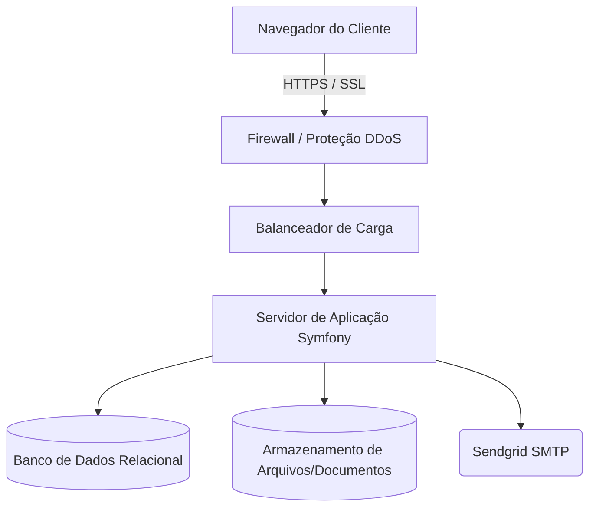

# ORÇAMENTO PARA DESENVOLVIMENTO DE SISTEMA: GERENCIAMENTO DE ARQUIVOS

**Cliente:** Guilherme Martins
**Data:** 24 de Março de 2026
**Validade:** 15 dias corridos

---

## 1. INÍCIO

Prezado Guilherme Martins,

É com grande satisfação que a WAB Agência Digital apresenta esta proposta comercial para o desenvolvimento de seu novo Sistema de Gerenciamento de Arquivos. Com mais de 20 anos de experiência no mercado de tecnologia, nossa agência se consolidou pela entrega de soluções robustas, seguras e focadas em resultados práticos para nossos parceiros.

O objetivo deste documento é detalhar tecnicamente como construiremos uma plataforma de alta performance utilizando o framework Symfony (PHP 8.3), garantindo que a operação de envio e rastreio de documentos seja automatizada, auditável e extremamente eficiente para a sua organização.

Atualmente, a troca de arquivos sensíveis via e-mail ou serviços de nuvem genéricos gera falhas de segurança e falta de rastreabilidade — o remetente raramente sabe o momento exato em que o destinatário acessou o conteúdo. A necessidade de Guilherme Martins é centralizar esse fluxo em um ambiente proprietário, onde o cadastro de novos usuários passe por uma camada de aprovação humana (moderação), garantindo que apenas parceiros autorizados operem no sistema.

A WAB propõe uma solução que resolve a dor da incerteza: ao automatizar a detecção de download via rastreadores de link exclusivos, o sistema fornece prova digital de recebimento de forma passíva e segura, sem qualquer ação extra por parte do remetente.

---

## 2. ESCOPO E MÓDULOS

Nesta seção, detalhamos cada componente visual e lógico da plataforma, com descrição exaustiva de todas as telas derivadas das entidades mapeadas.

### Módulo: Acesso e Segurança (RBAC)
O sistema utilizará autenticação Firewall do Symfony com RBAC (Role-Based Access Control).
- **ROLE_ADMIN:** Acesso total a painéis de moderação, configuração de tipos de arquivos e visão global do sistema.
- **ROLE_USER:** Acesso restrito aos seus próprios arquivos, dashboard pessoal e envio de novos documentos.
- **Camada de Aprovação:** Novos cadastros entram com status "Pendente" e não conseguem acessar nenhuma funcionalidade até que um Admin altere o status para "Aprovado".

---

### Tela: Registro Inicial de Usuário

**Objetivo Estratégico:**
Permitir que novos parceiros (Pessoa Jurídica ou Pessoa Física) submetam seus dados cadastrais completos para análise e posterior aprovação de acesso ao sistema.

**Estrutura de Componentes e Layout:**
- **Cabeçalho/Navegação:** Logotipo do sistema no topo centralizado; link "Já sou cadastrado — Login".
- **Área Principal (Conteúdo):** Formulário dividido em três blocos sanfonados (Accordions):
  - **Bloco 1 — Pessoa Jurídica:** CNPJ, Nome Fantasia, Razão Social, E-mail corporativo, Telefone Principal.
  - **Bloco 2 — Endereço:** CEP (busca automática), Logradouro, Número, Complemento, Município, Estado.
  - **Bloco 3 — Pessoa Física:** Nome, CPF, E-mail pessoal, Telefone Celular.
- **Botões e Ações:** Botão primário largo [Finalizar Cadastro e Aguardar Aprovação].

**Fluxo de Interação e Regras:**
Ao clicar em salvar, o sistema valida os campos, cria o registro com status "PENDENTE" e dispara e-mails de confirmação para o usuário e alerta para o administrador.

---

### Tela: Dashboard do Administrador Geral

**Objetivo Estratégico:**
Fornecer ao gestor uma visão panorâmica e quantitativa da saúde e do volume de uso da plataforma em tempo real.

**Estrutura de Componentes e Layout:**
- **Cabeçalho/Navegação:** Sidebar lateral com links: Dashboard, Usuários, Documentos, Tipos de Arquivo. Top bar com nome do Admin e logout.
- **Área Principal (Conteúdo):** Grid de 3 Cards de Indicadores (KPIs) no topo:
  - **Card 1:** Título "Total de Usuários"; Valor dinâmico.
  - **Card 2:** Título "Total de Documentos"; Valor dinâmico.
  - **Card 3:** Título "Total de Administradores"; Valor dinâmico.
- **Botões e Ações:** Botão [Verificar Usuários Pendentes] e atalhos rápidos de gestão.

**Fluxo de Interação e Regras:**
Os cards são atualizados dinamicamente. Ao clicar, o Admin é redirecionado para a listagem correspondente com filtros aplicados.

---

### Tela: Dashboard do Usuário Comum

**Objetivo Estratégico:**
Oferecer ao usuário o controle sobre seus envios e uma visualização analítica da performance de seus documentos de forma centralizada.

**Estrutura de Componentes e Layout:**
- **Cabeçalho/Navegação:** Sidebar do Usuário (Dashboard, Meus Arquivos, Novo Envio).
- **Área Principal (Conteúdo):**
  - **Topo:** Widget "Total de arquivos já enviados" em destaque.
  - **Centro:** Gráfico de Linhas mostrando os últimos 6 meses com a volumetria de envios mensais.
  - **Base:** Listagem compacta dos 5 últimos documentos enviados.
- **Botões e Ações:** Botão flutuante [Novo Envio] no canto inferior direito.

**Fluxo de Interação e Regras:**
O gráfico permite a visualização detalhada por mês. Os dados são filtrados automaticamente pelo ID do usuário logado.

---

### Tela: Entrada e Cadastro de Novo Arquivo

**Objetivo Estratégico:**
Facilitar o upload seguro de documentos e a definição automatizada das regras de envio e rastreio para o destinatário final.

**Estrutura de Componentes e Layout:**
- **Cabeçalho/Navegação:** Sidebar padrão; Título da página "Novo Envio de Arquivo".
- **Área Principal (Conteúdo):** Formulário verticalizado com campos:
  - **Campo 1:** Seleção de Tipo de Arquivo (dinâmico).
  - **Campo 2:** Data e Horário (auto-preenchido, mas permite edição).
  - **Campo 3:** Identificação (entrada livre).
  - **Campo 4:** Finalidade (entrada livre).
  - **Campo 5:** Título do Arquivo (obrigatório).
  - **Campo 6:** Upload do documento (Dropzone).
  - **Campo 7:** Nome do Destinatário.
  - **Campo 8:** E-mail do Destinatário.
- **Botões e Ações:** Botão [Cadastrar e Enviar Arquivo].

**Fluxo de Interação e Regras:**
Ao finalizar, o sistema move o arquivo para armazenamento seguro, gera o Hash de rastreio, define status como "EM TRÂNSITO" e dispara o e-mail transacional ao destinatário com o link de acesso.

---

### Tela: Landing de Download (Detecção de Recebimento)

**Objetivo Estratégico:**
Página técnica responsável por validar o acesso do destinatário, registrar a telemetria do download e liberar o arquivo com segurança.

**Estrutura de Componentes e Layout:**
- **Cabeçalho/Navegação:** Logotipo WAB e mensagem institucional de segurança.
- **Área Principal (Conteúdo):** Mensagem "Olá [Nome], seu arquivo '[Título]' está pronto para download".
- **Botões e Ações:** Botão grande de destaque [Iniciar Download Agora].

**Fluxo de Interação e Regras:**
Ao clicar, o sistema Symfony intercepta a requisição, localiza o arquivo via Hash, altera o status para "RECEBIDO" no banco de dados e inicia o streaming do arquivo para o navegador do destinatário.

---

## 3. ITENS NÃO INCLUSOS

Apenas para documentar, segue uma lista de itens não contemplados por esta proposta e que, caso sejam solicitados, serão cobrados à parte, de acordo com sua complexidade e disponibilidade da equipe.

**Suporte a ferramentas de terceiros:**  
Não está incluso neste orçamento o suporte à utilização de ferramentas como Adobe Photoshop, CorelDraw, Internet Explorer, Gateways de pagamento, Correios, etc.

**Conteúdo:**  
O conteúdo do sistema, incluindo textos, imagens e outros recursos, serão fornecidos pelo cliente antes do início do desenvolvimento.

**Correção de material:**  
A WAB não se responsabiliza por eventuais erros de ortografia ou de interpretação nos textos inseridos pelo cliente utilizando a área administrativa do sistema.

**Tecnologia dos navegadores:**  
Embora o sistema funcione perfeitamente em quase todos os navegadores existentes, a WAB garante que o sistema a ser desenvolvido funcionará corretamente nos navegadores Google Chrome, Mozilla Firefox, Microsoft Edge, Apple Safari e Opera.

**Atualizações e manutenção do sistema:**  
A manutenção contínua do sistema, incluindo atualizações de conteúdo, correções de erros e aprimoramentos, não está incluída nesta proposta. Serviços de manutenção do sistema podem ser contratados separadamente, se necessário.

---

## 4. PLANEJAMENTO DO PROJETO E METODOLOGIA

### Regras de Alteração de Escopo (Change Request)
Qualquer alteração, funcionalidade adicional ou ajuste de requisito solicitado que não esteja explicitamente detalhado nesta Proposta será considerada uma alteração de escopo (Change Request).

**Processo:**  
Toda solicitação de alteração deverá ser documentada por escrito.

**Orçamento:**  
A WAB Agência Digital fornecerá um orçamento de horas técnicas, custo e prazo adicionais para a implementação da alteração.

**Aprovação:**  
O trabalho de alteração de escopo só será iniciado após a aprovação formal (por e-mail ou assinatura) sobre o novo orçamento.

**Base de Custo:**  
A hora técnica para Change Requests será aplicada conforme a Tabela de Hora Técnica vigente da WAB (**R$ 220,00 por Homem/Hora WAB**).

## Regras de Alteração de Escopo (Change Request)

Qualquer alteração, funcionalidade adicional ou ajuste de requisito solicitado pelo cliente que não esteja explicitamente detalhado nesta Proposta será considerada uma alteração de escopo (Change Request).

* **Processo:** Toda solicitação de alteração deverá ser documentada por escrito.  
* **Orçamento:** A WAB Agência Digital fornecerá um orçamento de horas técnicas, custo e prazo adicionais para a implementação da alteração.  
* **Aprovação:** O trabalho de alteração de escopo só será iniciado após a aprovação formal (por e-mail ou assinatura) do cliente sobre o novo orçamento.  
* **Base de Custo:** A hora técnica para Change Requests será aplicada conforme a Tabela de Hora Técnica vigente da WAB (**R$ 220,00 por Homem/Hora WAB**).

---

## 5. GARANTIA E NÍVEL DE SERVIÇO (SLA)

### Garantia de Software (Bugfix)

A WAB Agência Digital oferece uma garantia de 180 dias (seis meses) a partir da data do Go-Live (Publicação em Produção) para a correção de quaisquer erros de programação (bugs) ou falhas que desviem do comportamento e requisitos descritos nesta proposta até o limite de 30 horas.

* As correções de bugs dentro deste período serão realizadas sem custo adicional para o cliente.  
* A garantia não cobre problemas causados por modificações feitas no código-fonte pelo cliente ou por terceiros não autorizados pela WAB, nem problemas decorrentes da infraestrutura ou de ferramentas de terceiros.

### Acordo de Nível de Serviço (SLA) para Suporte

Após a utilização do pacote inicial de 30 horas de suporte técnico, o cliente poderá contratar pacotes de horas adicionais. O SLA para os serviços de suporte (para problemas ou dúvidas, não cobertos pela garantia de bugfix) será:

| Prioridade | Definição | Tempo Máximo de Resposta (Início do Atendimento) |
| :---- | :---- | :---- |
| **Crítica** | Falha que impede a operação do sistema (ex: Login não funciona, Pedido indisponível). | **2 Horas Úteis** |
| **Alta** | Falha que compromete uma função essencial, mas permite a operação alternativa (ex: Relatório com erro de cálculo, Checkout lento). | **4 Horas Úteis** |
| **Média/Baixa** | Dúvidas de uso, ajustes de layout ou falhas não operacionais. | **8 Horas Úteis** |

---

## 6. TRANSIÇÃO E TREINAMENTO

### Plano de Migração de Dados

A transição para o novo sistema exige a migração de dados históricos do sistema anterior.

* **Responsabilidade:** O cliente é responsável por extrair os dados legados do sistema anterior em formato de planilha (CSV ou Excel) com colunas devidamente mapeadas e definidas em conjunto com a WAB.  
* **Importação:** A WAB desenvolverá os scripts necessários para a importação e validação desses dados no novo sistema.  
* **Dados a Migrar:** Serão migrados dados cadastrais e dados transacionais críticos.

### Treinamento de Usuários

O treinamento visa garantir que todas as equipes do cliente utilizem o novo sistema de forma eficiente.

* **Público-Alvo:** O treinamento será segmentado por funções (Atendimento, Logística/Produção e Administração/Gestão).  
* **Duração e Formato:** A WAB fornecerá 20 horas de treinamento, distribuídas conforme o cronograma de implantação, em formato online ou presencial (a ser acordado), com foco na operação do novo sistema e nas novas funcionalidades de workflow.  
* **Conteúdo:** O treinamento abrangerá a criação e rotina operacional completa.

---

## 7. HOSPEDAGEM INICIAL

Para manter a estrutura do sistema, é necessário a contratação de um plano de hospedagem. Recomendamos um plano de hospedagem inicial conforme tabela abaixo. Em caso de alteração de escopo, o cliente poderá ter a necessidade de um novo plano de hospedagem.

**Mapa da estrutura**  
Abaixo segue um mapa de como planejamos montar a estrutura física que conterá o sistema:

### SERVIÇOS INCLUSOS

**SSL para navegação segura (HTTPS):**  
Será implementado um certificado SSL para garantir que todas as comunicações com o seu sistema sejam criptografadas e seguras.

**Bcrypt para Criptografia de Senhas:**  
Utilizaremos o algoritmo Bcrypt para criptografar as senhas dos usuários, garantindo alta segurança.

**Acesso ao Servidor Apenas por SSH com Chave:**  
O acesso ao servidor será restrito apenas a usuários autorizados por meio de autenticação SSH com chaves, garantindo maior segurança.

**Sistema de Envio de E-mails pelo Sendgrid:**  
Implementaremos o Sendgrid para garantir um sistema confiável de envio de e-mails.

**Firewall dentro da Rede:**  
Será configurado um firewall de rede para proteger o seu sistema contra ameaças externas.

**Monitoramento de Uptime 24h por Dia:**  
Implementaremos um sistema de monitoramento 24 horas por dia para garantir que o seu sistema esteja sempre disponível.

**Backup Recorrente a Cada 12h por 7 Dias:**  
Realizaremos backups recorrentes a cada 12 horas e manteremos os últimos 7 dias de backups disponíveis.

**Versionamento do Projeto com Git/Bitbucket:**  
Utilizaremos repositórios privados para o versionamento do seu projeto, garantindo o controle de alterações e a colaboração eficiente.

**Deploy Seguro Apenas com SSH:**  
O deploy do seu projeto será realizado de forma segura, apenas por meio de autenticação SSH (Processos de CI/CD automatizados).

### PLANOS DE HOSPEDAGEM
O custo da hospedagem do sistema nos servidores da WAB varia conforme a tabela abaixo:

| Inicial | Básico | Médio | Avançado |
| :--- | :--- | :--- | :--- |
| **Espaço em disco** | 10GB | 20GB | 40GB | 70GB |
| **Memória RAM** | 1GB | 2GB | 4GB | 8GB |
| **Transferência** | 1TB | 1TB | 2TB | 4TB |
| **vCPUs** | 1 | 1 | 2 | 4 |
| **Custo Mensal (R$)** | **380,00** | **2.200,00** | **3.850,00** | **6.200,00** |

---

## 8. PLANO DE DESENVOLVIMENTO CONTÍNUO

### OBJETIVO
O objetivo deste plano é garantir a evolução contínua do Sistema de Gerenciamento, por meio de horas técnicas dedicadas a melhorias, ajustes e acompanhamento especializado. Dessa forma, o cliente passa a contar com uma estrutura de atendimento recorrente para apoiar o crescimento do sistema, preservar sua estabilidade e viabilizar novas implementações com mais agilidade e previsibilidade.

### SERVIÇOS CONTEMPLADOS
O plano contempla horas técnicas voltadas à sustentação, aprimoramento e evolução do sistema, permitindo que novas demandas sejam tratadas de forma organizada e contínua. Entre as atividades que poderão ser realizadas, destacam-se:

* **Ajustes e Evoluções Técnicas**: Correções pontuais, melhorias em funcionalidades existentes, atualização de bibliotecas e componentes utilizados pelo sistema.  
* **Implementação de Novos Recursos**: Desenvolvimento de novas funcionalidades, APIs, módulos e adaptações que venham a ser identificadas ao longo do uso da plataforma.  
* **Aprimoramento de Desempenho**: Ações voltadas à melhoria da performance do sistema, incluindo otimizações de banco de dados, processamento e estabilidade geral da aplicação.  
* **Acompanhamento e Consultoria Técnica**: Apoio consultivo para análise de demandas, definição de prioridades, orientação técnica e acompanhamento da evolução do projeto.

### DIRETRIZES DE ATENDIMENTO
* **Janela de Atendimento**: Os atendimentos serão realizados de segunda a sexta-feira, das 9h às 18h, no período de 10 de janeiro a 20 de dezembro.  
* **Início do Atendimento**: As solicitações serão analisadas e programadas em até 2 (dois) dias úteis.  
* **Prazo de Execução**: O prazo para execução será definido de acordo com a complexidade de cada demanda, sempre com alinhamento prévio.  
* **Atendimentos Presenciais**: Quando houver necessidade de atendimento fora da cidade de Araraquara-SP, eventuais despesas com deslocamento, alimentação e hospedagem poderão ser repassadas ao cliente.  
* **Apontamento Técnico Mínimo**: Cada atendimento será contabilizado com o mínimo de 1 (uma) hora técnica, considerando etapas como análise, desenvolvimento, testes, homologação, publicação e versionamento.

### DEMANDAS ADICIONAIS
* Caso o volume de demandas ultrapasse a quantidade de horas prevista, poderão ser disponibilizadas horas complementares, mediante alinhamento prévio.  
* Atividades realizadas além da carga horária prevista no plano, ou fora da janela normal de atendimento, serão tratadas como demandas adicionais e orçadas conforme a necessidade.

---

## 9. PRAZO, DESLOCAMENTO E MATERIAL

**Prazo Estimado:** O projeto será desenvolvido em um período de aproximadamente 8 semanas, divididas em sprints quinzenais de entrega.

**Material do Cliente:** Identidade visual, manual da marca (se houver) e lista inicial de tipos de documentos para cadastro.

---

## 10. CRONOGRAMA ESTIMADO

| Fase | Atividade Principal | Período |
|---|---|---|
| 01 | Setup do Ambiente, Autenticação e Cadastro PJ/PF | Semana 1 e 2 |
| 02 | Módulo Administrativo e Moderação | Semana 3 e 4 |
| 03 | Dashboards e Módulo de Upload Seguro | Semana 5 e 6 |
| 04 | Sistema de Rastreio, E-mails e Homologação | Semana 7 e 8 |

---

## 11. VALIDADE DA PROPOSTA

Esta proposta comercial possui validade de **15 (quinze) dias corridos** a partir da data de emissão.

---

## 12. APRESENTAÇÃO INSTITUCIONAL

## Apresentação
Primeiramente, gostaríamos de agradecer pela oportunidade de trabalhar com a sua empresa.
A WAB Agência Digital é uma empresa com mais de 20 anos de experiência em comunicação pela Internet. Somos especializados em oferecer soluções abrangentes, que incluem desenvolvimento de sites personalizados, sistemas sob demanda, aplicativos móveis, hospedagem web, integração de sistemas e marketing digital.
A solução apresentada nesta proposta foi criada por nossa equipe de especialistas, após uma análise de suas necessidades.
A nossa equipe está à sua disposição para qualquer dúvida ou para esclarecer os detalhes do projeto pelos telefones (16) 98179-0888 / (16) 3332-7798 ou pelo e-mail wab@wab.com.br.

---

## 13. CONDIÇÕES COMERCIAIS

### Investimento em Desenvolvimento

| Módulo do Sistema | Valor Estimado |
|---|---|
| Core Symfony + Segurança e RBAC | R$ 12.500,00 |
| Dashboard e Cadastro exaustivo (PJ/PF) | R$ 9.800,00 |
| Módulo Administrativo e Moderação | R$ 8.400,00 |
| Dashboard Usuário + Upload e Rastreio | R$ 14.200,00 |
| **TOTAL DO INVESTIMENTO** | **R$ 44.900,00** |

## CONDIÇÕES COMERCIAIS E FINANCEIRAS

### Plano de Pagamento
O pagamento pelo desenvolvimento do sistema será dividido em marcos de entrega (milestones), conforme a tabela abaixo:

| Etapa de Pagamento | Descrição | Percentual |
| :--- | :--- | :--- |
| **Sinal/Início** | Na assinatura desta Proposta e início do desenvolvimento. | 40% |
| **Entrega Fase Frontend** | Na conclusão e homologação de todo o Layout e Fluxo de Telas. | 30% |
| **Go-Live e Encerramento** | Após o Go-Live e liberação do banco em produção. | 30% |
| **Total** | | **100%** |

---

   

**Pela CONTRATADA:**  
Jonas Ernesto Poli  
CPF: 296.652.468-52  
WAB Agência Digital / M. DUDALSKI & CIA SOLUÇÕES EM INTERNET  

   

**Pelo CONTRATANTE:**  
____________________________________  
**Guilherme Martins**  
CPF/CNPJ: _________________  
