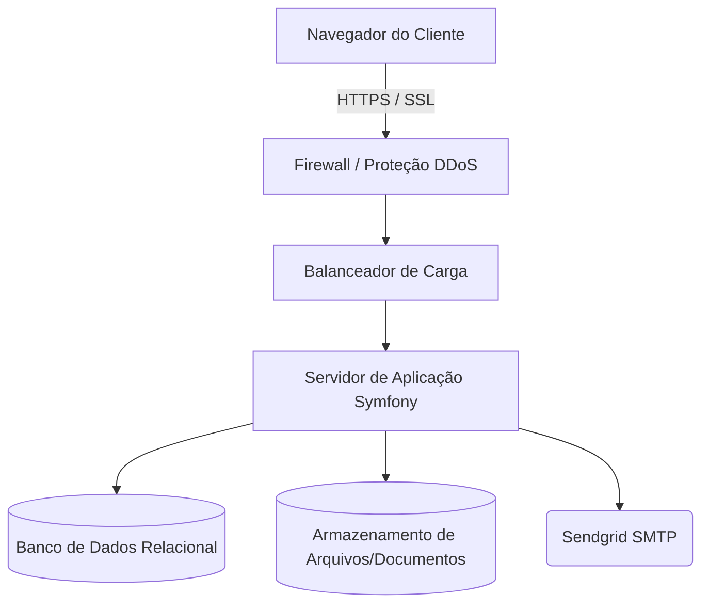

## HOSPEDAGEM INICIAL

Para manter a estrutura do sistema, é necessário a contratação de um plano de hospedagem. Recomendamos um plano de hospedagem inicial conforme tabela abaixo. Em caso de alteração de escopo, o cliente poderá ter a necessidade de um novo plano de hospedagem.

**Mapa da estrutura**  
Abaixo segue um mapa de como planejamos montar a estrutura física que conterá o sistema:

### SERVIÇOS INCLUSOS

**SSL para navegação segura (HTTPS):**  
Será implementado um certificado SSL para garantir que todas as comunicações com o seu sistema sejam criptografadas e seguras.

**Bcrypt para Criptografia de Senhas:**  
Utilizaremos o algoritmo Bcrypt para criptografar as senhas dos usuários, garantindo alta segurança.

**Acesso ao Servidor Apenas por SSH com Chave:**  
O acesso ao servidor será restrito apenas a usuários autorizados por meio de autenticação SSH com chaves, garantindo maior segurança.

**Sistema de Envio de E-mails pelo Sendgrid:**  
Implementaremos o Sendgrid para garantir um sistema confiável de envio de e-mails.

**Firewall dentro da Rede:**  
Será configurado um firewall de rede para proteger o seu sistema contra ameaças externas.

**Monitoramento de Uptime 24h por Dia:**  
Implementaremos um sistema de monitoramento 24 horas por dia para garantir que o seu sistema esteja sempre disponível.

**Backup Recorrente a Cada 12h por 7 Dias:**  
Realizaremos backups recorrentes a cada 12 horas e manteremos os últimos 7 dias de backups disponíveis.

**Versionamento do Projeto com Git/Bitbucket:**  
Utilizaremos repositórios privados para o versionamento do seu projeto, garantindo o controle de alterações e a colaboração eficiente.

**Deploy Seguro Apenas com SSH:**  
O deploy do seu projeto será realizado de forma segura, apenas por meio de autenticação SSH (Processos de CI/CD automatizados).

### PLANOS DE HOSPEDAGEM
O custo da hospedagem do sistema nos servidores da WAB varia conforme a tabela abaixo:

| Inicial | Básico | Médio | Avançado |
| :--- | :--- | :--- | :--- |
| **Espaço em disco** | 10GB | 20GB | 40GB | 70GB |
| **Memória RAM** | 1GB | 2GB | 4GB | 8GB |
| **Transferência** | 1TB | 1TB | 2TB | 4TB |
| **vCPUs** | 1 | 1 | 2 | 4 |
| **Custo Mensal (R$)** | **380,00** | **2.200,00** | **3.850,00** | **6.200,00** |
